# The Survey/Spreadsheet export scenario!

The guide present how to gather data from your customers, citizen, attendees, listener or any kind of people that might produce data or share their opinion or information.

To do so, it's convenient to use simple tools like online survey platforms, online spreadsheet platforms that as built-in CSV export feature, and finally get this data into OpenDataSoft to store, process, and provide advanced analytic dashboards to display it.

**The different steps explained :**
    
- A form will help users to fill in the requested information or data
- This form will automatically fill a spreadsheet with all the answers
- A first round of processing can be applied in the spreadsheet tool itself
- Then, the spreadsheet will be exported as a standard export form like CSV. In some tool we talk about publishing the spreadsheet publicly.
- This direct access link will be used as the remote source of an OpenDataSoft dataset.
- A more advance round of processing can be applied on the data.
- The data is published and is now ready to be visualized.

In this guide we will see how to do so with **Google Form** as the form tool. **Google Sheets** as the spreadsheet tool and CSV publisher.
We will finally apply some advanced processing and create a simple dashboard to analyse the results.

## Live example!

Share withs us your travel experiences! And see how it goes on the platform! 

The form:
https://docs.google.com/forms/d/e/1FAIpQLScQw8zszuqt37pPN_wPZcLfhc50MMoI-_8P_AK-pYlBWQg2dw/viewform?usp=sf_link

The dataset:
https://discovery.opendatasoft.com/explore/dataset/travel-experience-survey/

 
## How to :

#### Create a from

Go to **Google Form** [here](https://docs.google.com/forms/u/0/), create a new form by adding some questions about your customer, or metadata that you'd like to collect.

In this example, we will create a database of public museums.
The aim is to create a database with the name of the musuem, a description, the type, a location and a picture.

1. A form with input fields:
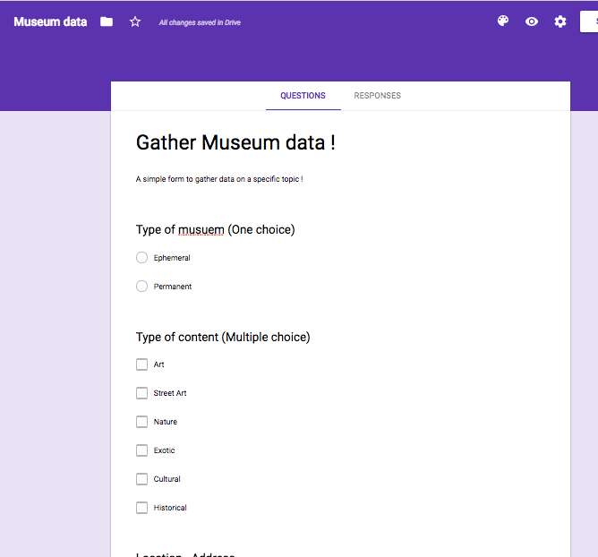

1. An URL input field to get an image:
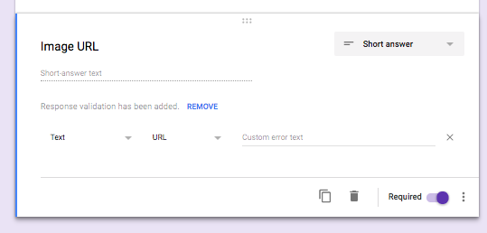

1. Digit input field with content restrictions:
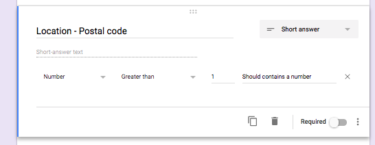

1. Google Form propose different features like splitting your form in blocks to create several pages 
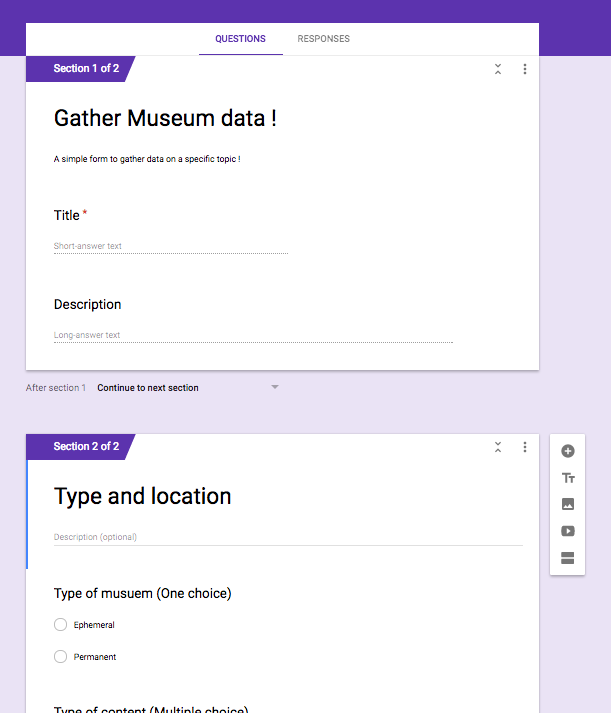

1. Once your form created, go to Responses, and click on the Google Sheets icon
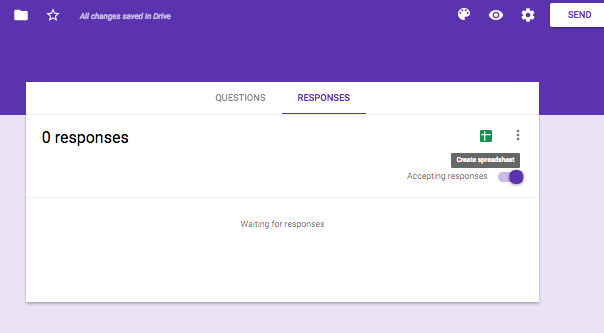

1. Create a new spreadsheet
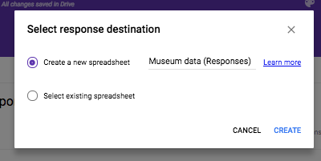

1. Observe the spreadsheets column list
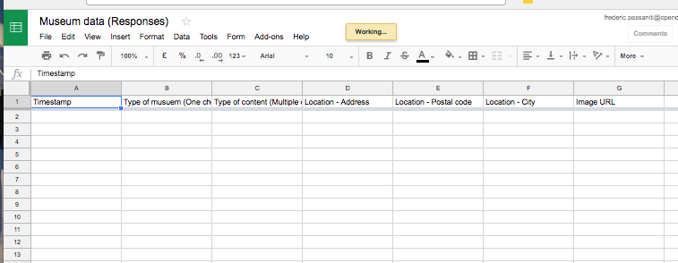

1. It's now time to test the form and see the results
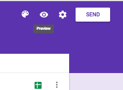

1. Test
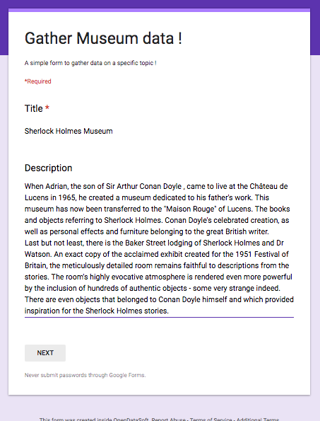
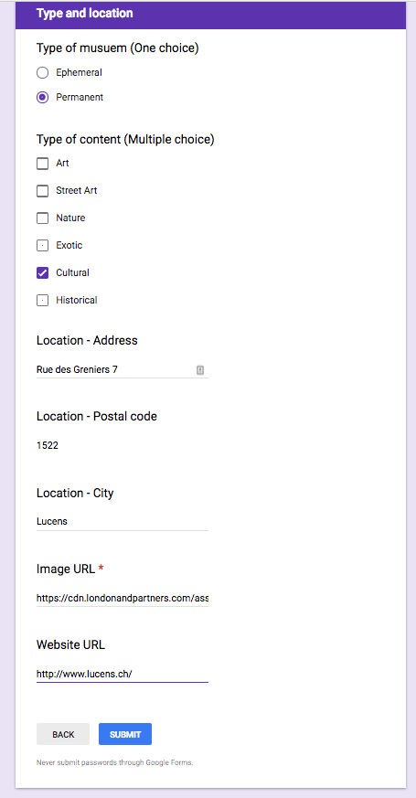

1. After a few tests, go back to the spreadsheet and see the first lines. It's the result of your submissions.
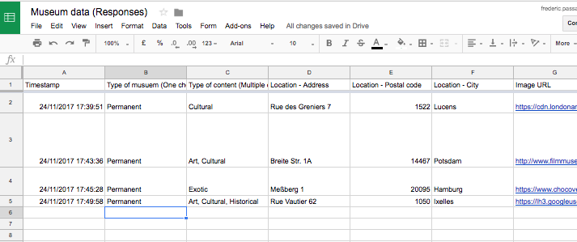

1. It's now time to export this spreadsheet, go to File, Publish to the web...
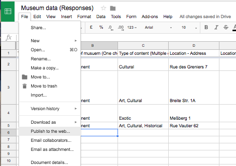

1. Select the CSV format, and publish to get the export link. Copy it.
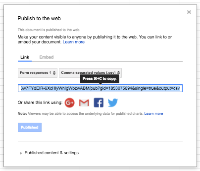

    
#### Time to go to OpenDataSoft :

1. Create a new dataset
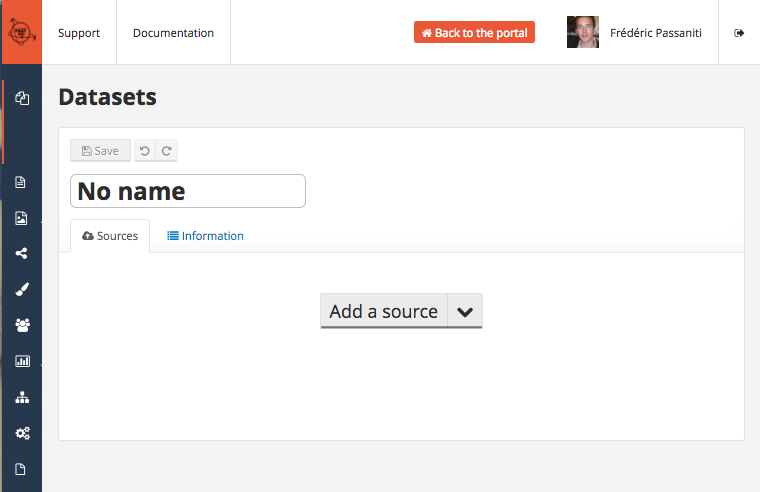

1. Add a source, paste the url in the URL input field
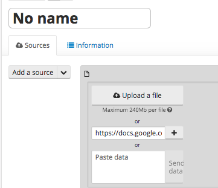

1. See the preview that OpenDataSoft successfully got the data and understood the file format
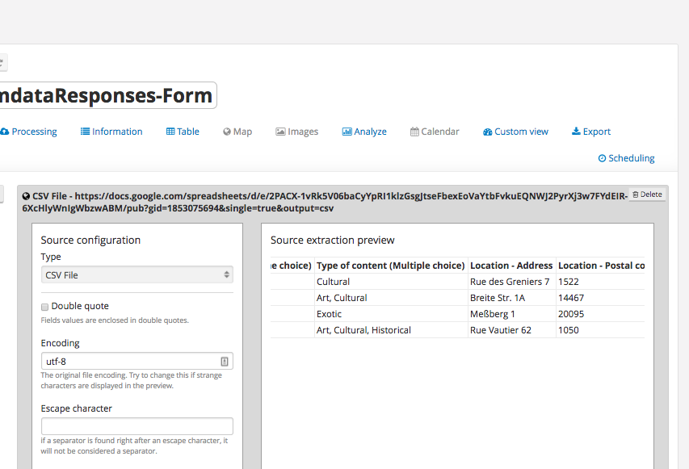

1. Let's do the classic feature round table
    1. Add some facets
        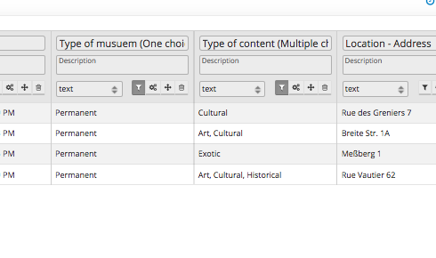
    1. Multiple text input fields can be set as multivalued facets
        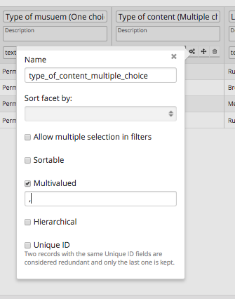
    1. Force columns types, specially for identifier as text
        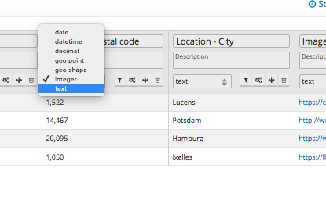
    1. The File processor is usefull to get the picture linked by the URL, add a File processor and select the corresponding field.
        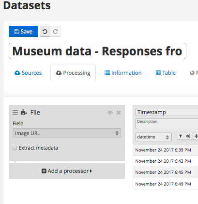
       
1. Time to save, publish and see the result ! The table view:
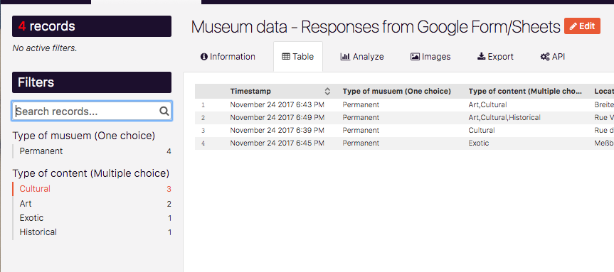

1. The image gallery:
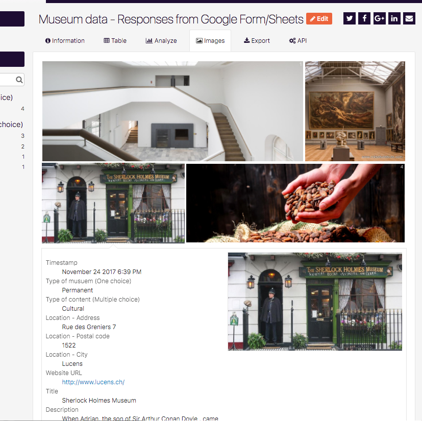

Congratulation ! You have your first crowdsourced-ready dataset !

The final requirement will be to activated the scheduling !
- Go back to your back-office, go to your dataset, scheduling tab:
    - add some scheduling, for example 2 hourly scheduling at 00 and 30. (to get new data and publish it every 30 minutes)
- Submit some other tests, wait, and see how your new submits are processed and published automatically on your OpenDataSoft platform!
