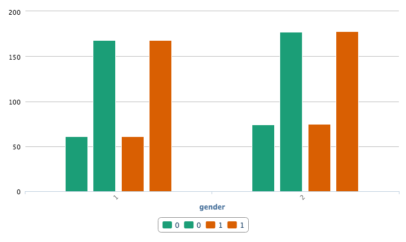

### How to display chart data into a data table

Consider a dataset containing male and female profile with their height and weight.
Each profile is validated or not.

We would like to display in a chart the average height and weight split by gender.
We would also like to split the gender axis by a second dimension : the account validation status.

Here's an example of the final result.



Data sample :

<pre>
#1
gender : 2 (Male)
height: 187
weight: 74
isvalid: 1

#2
gender : 1 (Female)
height: 168
weight: 57
isvalid: 0
</pre>

Chart HTML code :

```html
<ods-chart single-y-axis="true">
    <ods-chart-query context="mycontext" field-x="gender" series-breakdown="isvalid">
        <ods-chart-serie expression-y="height" chart-type="column" function-y="AVG" color="range-Dark2">
        </ods-chart-serie>
        <ods-chart-serie expression-y="weight" chart-type="column" function-y="AVG" color="range-Dark2">
        </ods-chart-serie>
    </ods-chart-query>
</ods-chart>
```


Chart result :


Now, to display these values into a table, let's add this code into your ods-context :

Table HTML code :

```html
<table>
    <thead>
      <tr>
        <td>Height</td>
        <td>Weight</td>
        <td>Gender (account state)</td>
      </tr>
    </thead>
    <tbody>
      <tr ng-repeat="result in analysis.results"
           ods-analysis="analysis"
           ods-analysis-context="mycontext"
           ods-analysis-max="50"
           ods-analysis-x="gender"
           ods-analysis-x-split="isvalid"
           ods-analysis-serie-height="AVG(height)"
           ods-analysis-serie-weight="AVG(weight)"
           >
        <td ng-repeat="(i,e) in result">
          <p ng-if="!e.gender && !e.isvalid">
            {{ e }}
          </p>
          <div ng-if="e.gender == 2">
            Male
          </div>
          <div ng-if="e.isvalid == 1">
            (validated profile)
          </div>
          <div ng-if="e.gender == 1">
            Female
          </div>
          <div ng-if="e.isvalid == 0">
            (not validated)
          </div>
        </td>
      </tr>
    </tbody>  
</table>
```


Table result :

| Height             | Weight            | Gender (account state)    |
|--------------------|-------------------|---------------------------|
| 167.75321336760925 | 60.65638389031705 | Female (not validated)      |
| 168.01616322204558 | 61.27265500794912 | Female (validated profile)  |
| 177.17472719924558 | 74.3245318604338 | Male (not validated)    |
| 177.8441081661891  | 75.00420845272207 | Male (validated profile)|


With additional AngularJS filters :

```html
<p ng-if="!e.gender && !e.isvalid">
    {{ e | number:'1' }}
</p>
```

| Height | Weight | Gender (account state) |
|--------|--------|------------------------|
| 167.7 | 60.6 | Female (not validated)      |
| 168.0 | 61.2 | Female (validated profile)  |
| 177.1 | 74.3 | Male (not validated)    |
| 177.8 | 75.0 | Male (validated profile)|
